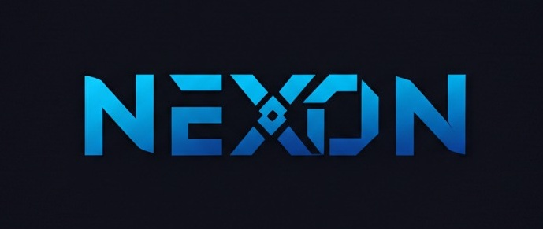

<p align="center">
  
</p>

<p align="center">
  <b>一款强大、现代的 AI 聊天界面，基于 Flutter 构建</b>
</p>

<p align="center">
  <a href="README.md">English</a> •
  <a href="README.zh.md">中文</a> •
  <a href="README.ar.md">العربية</a>
</p>

<p align="center">
  <a href="#功能特点">功能特点</a> •
  <a href="#截图">截图</a> •
  <a href="#即将推出">即将推出</a> •
  <a href="#安装">安装</a> •
  <a href="#使用方法">使用方法</a> •
  <a href="#贡献">贡献</a> •
  <a href="#许可证">许可证</a>
</p>

> 注意：由于该项目仍处于开发阶段（仅三小时的工作成果），目前尚不能发布 exe 或 apk 版本，可能存在不可用的功能。

## 概述

Nexon 是一款优雅、功能丰富的 AI 聊天应用，通过统一、精美的界面连接多个 AI 提供商。基于 Flutter 跨平台性能构建，Nexon 提供流畅的聊天体验，具有流式响应、实时反馈和高级自定义选项。

## 功能特点

### 核心体验
- **多提供商支持**：抽象架构支持多个 AI 提供商（目前支持 Gemini，并模拟了 OpenAI）
- **流式响应**：AI 响应实时流式传输，带有打字指示器
- **Material 3 设计**：采用电光蓝（#3B82F6）主题的现代 UI
- **对话流**：用户与 AI 之间自然的对话界面

### 高级功能
- **停止生成**：随时取消响应生成
- **复制与编辑**：编辑您的消息并重新生成响应
- **快速提示**：快速提示让您立即开始对话
- **Markdown 支持**：丰富的文本格式，包括代码块

### 设置与配置
- **提供商设置**：配置不同的 AI 提供商和模型
- **API 密钥管理**：安全存储和管理 API 密钥
- **响应参数**：微调模型参数，如温度和令牌数
- **自动保存**：所有设置自动保存到设备存储

## 截图

<p align="center">
  <i>即将推出 - Nexon 界面的精美截图</i>
</p>

## 即将推出

<p align="center">🚀 <b>Nexon 正在快速发展。以下是即将推出的功能：</b> 🚀</p>

### 🔜 MCP（模型控制协议）集成
先进的系统调用功能，允许 AI 模型以受控、安全的方式与您的系统交互

### 🔜 增强的 UI/UX
- 可自定义的主题和布局
- 动画和过渡效果
- 响应式设计改进
- 语音输入和输出功能

### 🔜 提供商扩展
- 完整的 OpenAI 集成（GPT-3.5，GPT-4）
- DeepSeek 模型集成
- Claude 和其他领先的 AI 提供商
- 自定义模型托管连接

### 🔜 高级功能
- 图像生成和分析功能
- 多模态输入（文本、图像、文件）
- 上下文感知的知识库连接
- 用于扩展性的插件生态系统

## 安装

```bash
# 克隆此仓库
git clone https://github.com/wisamidris77/nexon.git

# 导航到项目目录
cd nexon

# 安装依赖
flutter pub get

# 运行应用
flutter run
```

## 使用方法

1. 启动应用
2. 导航到"设置"添加您的 API 密钥
3. 选择您首选的 AI 提供商和模型
4. 使用快速提示或自己的消息开始聊天
5. 享受实时 AI 响应，完全控制生成过程

## 贡献

欢迎贡献！请随时提交拉取请求。

1. Fork 仓库
2. 创建您的功能分支（`git checkout -b feature/amazing-feature`）
3. 提交您的更改（`git commit -m 'Add some amazing feature'`）
4. 推送到分支（`git push origin feature/amazing-feature`）
5. 打开拉取请求

## 许可证

该项目采用 MIT 许可证 - 详情请参见 LICENSE 文件。

---

<p align="center">
  <b>Nexon - AI 聊天界面的未来</b>
</p> 